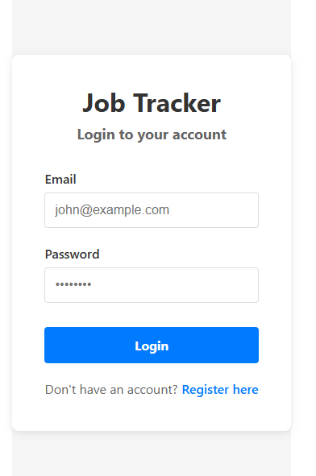
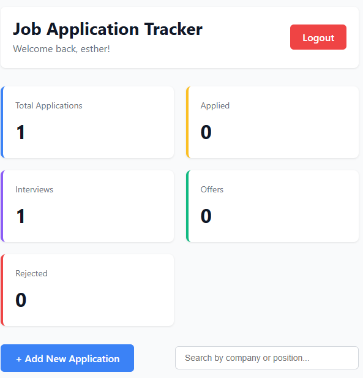
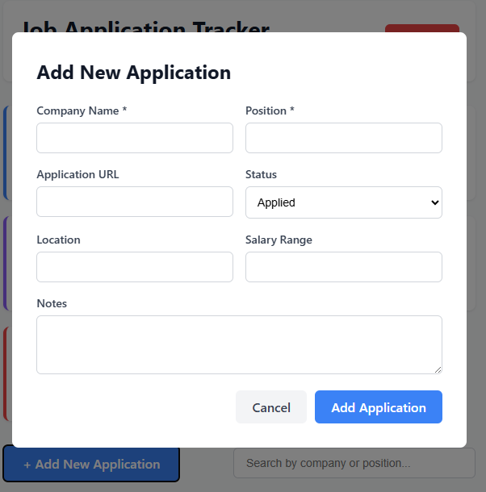

# Job Tracker

A full-stack Job Application Tracker that helps users organize and monitor their job applications in one place.

## Features

- User registration and login
- Secure JWT authentication
- Add new job applications
- Update application status
- Delete applications
- Search applications
- Filter applications by status
- Dashboard statistics

## Tech Stack

### Frontend
- React
- Vite
- Axios

### Backend
- Node.js
- Express.js
- MongoDB
- JWT Authentication

  ## 📸 Screenshots

### Login Page


### Dashboard


### Add Job



## Project Structure

```
job-tracker/
├── frontend/
├── backend/
└── README.md
```

## Installation

### Clone the repository

```bash
git clone <repository-url>
```

### Install dependencies

Backend

```bash
cd backend
npm install
```

Frontend

```bash
cd frontend
npm install
```

### Run the application

Backend

```bash
npm start
```

Frontend

```bash
npm run dev
```

## Environment Variables

Create a `.env` file inside the `backend` folder with:

```text
MONGO_URI=your_mongodb_connection_string
JWT_SECRET=your_secret_key
```

## Author: Okon Esther
